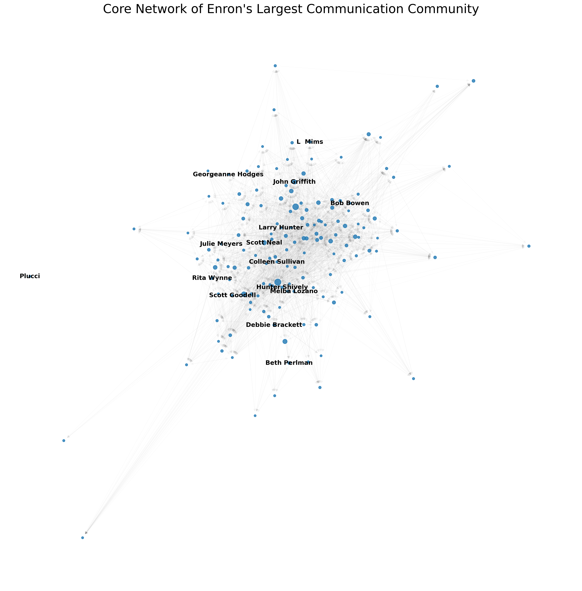

# Network Analysis of the Enron Email Dataset

[](https://www.python.org/downloads/release/python-3100/)                                                                                                
**Author:** **Sourabh Sonker (Aspiring Data Scientist)**

---

### **Project Overview**

This project performs a comprehensive network analysis of the publicly available Enron email dataset. The goal is to uncover the underlying social and organizational structures, identify key influencers, and visualize the flow of communication within the company. By modeling employees as nodes and emails as connections, we can apply graph theory concepts to extract powerful insights from this complex, real-world dataset.

This project serves as a practical demonstration of skills in data engineering, graph analytics, machine learning (community detection), and data visualization.

### **Final Visualization: The Core of Enron's Largest Communication Community**

This graph visualizes the 150 most central members of the largest communication community found within Enron.

*   **Node Size:** Proportional to the person's **In-Degree Centrality** (how many emails they received), indicating their importance as an information hub.
*   **Labels:** Displayed for the top 15 most central individuals in this subgraph.
*   **Structure:** The layout reveals a dense, interconnected "core" of key players surrounded by a periphery of less connected members.



---

### **Key Analyses Performed**

*   **Data Parsing and ETL:** Processed and parsed over 500,000 raw email records from the Kaggle dataset to create a clean, structured list of communications (sender-receiver pairs).
*   **Network Graph Construction:** Built a weighted, directed graph representing the organization's communication network using the NetworkX library, with over 87,000 unique individuals (nodes) and 360,000 unique connections (edges).
*   **Centrality Analysis:** Identified key influencers by calculating three different centrality measures:
    *   **In-Degree Centrality:** To find individuals who received the most emails (major information hubs).
    *   **Betweenness Centrality:** To find individuals who act as critical "bridges" connecting disparate parts of the organization.
    *   **Eigenvector Centrality:** To find individuals connected to other highly influential people.
*   **Community Detection (Unsupervised Learning):** Applied the Louvain Modularity algorithm to partition the network into distinct communities, revealing hidden social circles, departments, and project teams.

### **Tech Stack**

*   **Language:** Python 3
*   **Core Libraries:**
    *   **Pandas:** For efficient data manipulation and cleaning.
    *   **NetworkX:** For creating, manipulating, and analyzing the network graph.
    *   **Matplotlib:** For creating the final data visualization.
    *   **python-louvain:** For implementing the community detection algorithm.

---

### **How to Run This Project**

To replicate this analysis, please follow these steps:

**1. Clone the Repository**
```bash
git clone https://github.com/your-username/your-repo-name.git
cd your-repo-name
```

**2. Set Up a Python Virtual Environment**
```bash
# Create the virtual environment
python -m venv venv

# Activate it
# On Windows:
.\venv\Scripts\activate
# On macOS/Linux:
source venv/bin/activate
```
**3. Install Dependencies**
All required libraries are listed in the requirements.txt file.
```bash
pip install -r requirements.txt
```
**4. Download the Dataset**
* Download the Enron email dataset from this [Kaggle page](https://www.kaggle.com/datasets/wcukierski/enron-email-dataset).
* Unzip the file and place the emails.csv file inside a data/ folder in the project's root directory. The final path should be
  data/emails.csv.

**5. Run the Analysis**
Execute the main Python script to perform the entire analysis and generate the visualization.
```bash
python enron_network_analysis.py
```
The script will print progress updates to the console and save the final graph as enron_network_visualization.png in the root directory.
